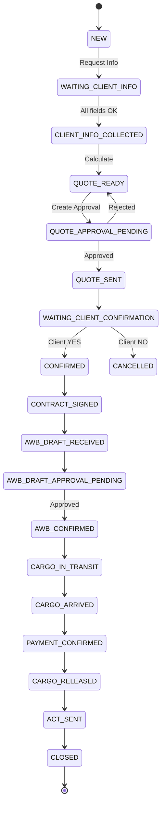
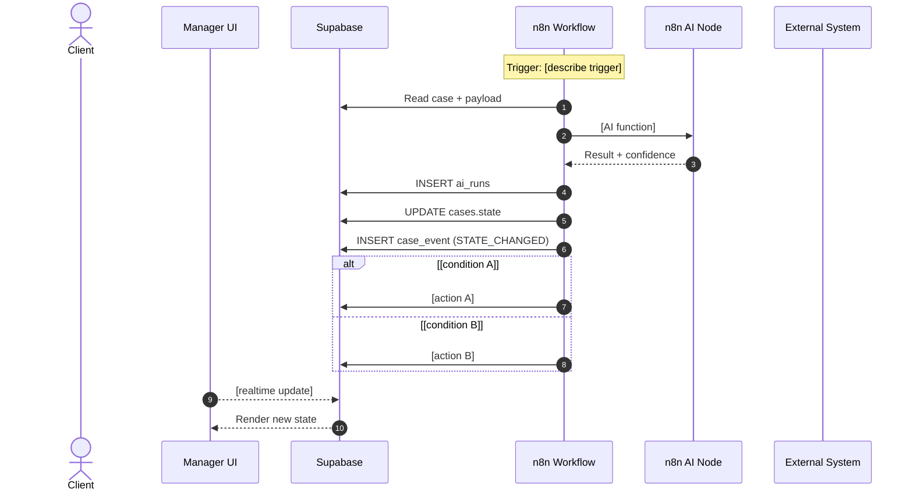

# Case Template Implementation Framework
## Покроковий гайд для розробників IMCP

**Версія:** 1.1  
**Статус:** Core / Framework  
**Аудиторія:** Розробники, архітектори, продукт-менеджери  
**Призначення:** Стандартизований процес перетворення сирих інструкцій менеджерів у повноцінний case_template

---

## Changelog

| Версія | Дата | Зміни |
|--------|------|-------|
| 1.1 | 2026-01-14 | Додано питання для адміністраторів сторонніх систем (1С, email, партнери) |
| 1.0 | 2026-01-14 | Initial release |

---

## Зміст

1. [Вступ: Мета та принципи](#1-вступ-мета-та-принципи)
2. [Огляд процесу](#2-огляд-процесу)
3. [Фаза 1: Збір та аналіз вхідних даних](#3-фаза-1-збір-та-аналіз-вхідних-даних)
4. [Фаза 2: Проектування State Machine](#4-фаза-2-проектування-state-machine)
5. [Фаза 3: Визначення даних та документів](#5-фаза-3-визначення-даних-та-документів)
6. [Фаза 4: Проектування Approval Gates](#6-фаза-4-проектування-approval-gates)
7. [Фаза 5: Автоматизація та AI правила](#7-фаза-5-автоматизація-та-ai-правила)
8. [Фаза 6: Sequence Diagrams](#8-фаза-6-sequence-diagrams)
9. [Фаза 7: UI Case Cockpit Spec](#9-фаза-7-ui-case-cockpit-spec)
10. [Фаза 8: n8n Workflows Map](#10-фаза-8-n8n-workflows-map)
11. [Фаза 9: Test Scenarios](#11-фаза-9-test-scenarios)
12. [Фаза 10: Sample Payloads](#12-фаза-10-sample-payloads)
13. [Чеклісти якості](#13-чеклісти-якості)
14. [Шаблони документів](#14-шаблони-документів)
15. [FAQ та типові помилки](#15-faq-та-типові-помилки)
16. [Glossary — Канонічні enums та naming conventions](#16-glossary--канонічні-enums-та-naming-conventions)
17. [Definition of Done для Case Template](#17-definition-of-done-для-case-template)

**Додатки:**
- [Додаток A: Приклад трансформації](#додаток-a-приклад-трансформації)
- [Додаток B: Контакти та ресурси](#додаток-b-контакти-та-ресурси)

---

## 1. Вступ: Мета та принципи

### 1.1 Мета фреймворку

Цей фреймворк забезпечує:
- **Повторюваність** — кожен новий case_template створюється за єдиним стандартом
- **Повноту** — нічого критичного не пропущено
- **Узгодженість** — з Core документацією IMCP
- **Швидкість** — мінімізація ітерацій "туди-сюди"

### 1.2 Вхід і вихід процесу

```
ВХІД:                                ВИХІД:
┌─────────────────────────┐          ┌─────────────────────────────────┐
│ Сира інструкція         │          │ Папка case_template:            │
│ менеджерів              │    ──►   │ • 00_case_overview.md           │
│ (текстовий документ)    │          │ • 01_states_and_flow.md         │
│                         │          │ • 02_required_data_and_documents.md │
│ + Інтерв'ю з SME        │          │ • 03_approval_gates.md          │
│ + Бізнес-контекст       │          │ • 04_automation_and_ai_rules.md │
│                         │          │ • 05_sequences.md               │
│                         │          │ • 06_ui_case_cockpit_spec.md    │
│                         │          │ • 07_n8n_workflows_map.md       │
│                         │          │ • 08_test_scenarios.md          │
│                         │          │ • 09_sample_payloads.md         │
└─────────────────────────┘          └─────────────────────────────────┘
```

### 1.3 Ключові принципи (з Core)

| Принцип | Застосування в case_template |
|---------|------------------------------|
| **Human-in-the-loop** | Кожна незворотна дія → Approval Gate |
| **State Machine** | Процес = граф станів, не список кроків |
| **Draft-First** | AI генерує чернетки, людина підтверджує |
| **Single Source of Truth** | Supabase зберігає все, n8n оркеструє |
| **Auditability** | Кожна дія логується в case_events |

---

## 2. Огляд процесу

### 2.1 Фази імплементації

```
┌──────────────────────────────────────────────────────────────────────────┐
│                     CASE TEMPLATE IMPLEMENTATION                         │
├──────────────────────────────────────────────────────────────────────────┤
│                                                                          │
│  ФАЗА 1          ФАЗА 2          ФАЗА 3          ФАЗА 4          ФАЗА 5 │
│  ┌─────┐         ┌─────┐         ┌─────┐         ┌─────┐         ┌─────┐│
│  │Збір │   ──►   │State│   ──►   │Дані │   ──►   │Gates│   ──►   │ AI  ││
│  │даних│         │Mach.│         │Docs │         │     │         │Auto ││
│  └─────┘         └─────┘         └─────┘         └─────┘         └─────┘│
│     │               │               │               │               │   │
│     ▼               ▼               ▼               ▼               ▼   │
│  ┌─────┐         ┌─────┐         ┌─────┐         ┌─────┐         ┌─────┐│
│  │ 00  │         │ 01  │         │ 02  │         │ 03  │         │ 04  ││
│  └─────┘         └─────┘         └─────┘         └─────┘         └─────┘│
│                                                                          │
│  ФАЗА 6          ФАЗА 7          ФАЗА 8          ФАЗА 9          ФАЗА 10│
│  ┌─────┐         ┌─────┐         ┌─────┐         ┌─────┐         ┌─────┐│
│  │Seqs │   ──►   │ UI  │   ──►   │ n8n │   ──►   │Tests│   ──►   │Sampl││
│  │     │         │Spec │         │ WFs │         │     │         │     ││
│  └─────┘         └─────┘         └─────┘         └─────┘         └─────┘│
│     │               │               │               │               │   │
│     ▼               ▼               ▼               ▼               ▼   │
│  ┌─────┐         ┌─────┐         ┌─────┐         ┌─────┐         ┌─────┐│
│  │ 05  │         │ 06  │         │ 07  │         │ 08  │         │ 09  ││
│  └─────┘         └─────┘         └─────┘         └─────┘         └─────┘│
│                                                                          │
└──────────────────────────────────────────────────────────────────────────┘
```

### 2.2 Ролі в процесі

| Роль | Відповідальність |
|------|------------------|
| **Developer/Architect** | Ведучий процесу, пише документацію та код |
| **SME (Subject Matter Expert)** | Менеджер з досвідом, джерело бізнес-знань |
| **Product Owner** | Пріоритизація, валідація бізнес-логіки |
| **QA** | Ревʼю тест-сценаріїв, валідація покриття |
| **1С Administrator** | Інформація про 1С API, об'єкти, обмеження |
| **IT/DevOps** | Доступи, credentials, мережева інфраструктура |
| **Finance/Accounting** | Процеси оплат, документообігу, звітності |
| **External Partners** | Агенти, брокери, склади — формати обміну |

### 2.3 Орієнтовна тривалість (на 1 case_template)

| Фаза | Тривалість | Залежності |
|------|------------|------------|
| Фаза 1 (Збір даних) | 1-2 дні | SME availability |
| Фаза 2 (State Machine) | 1 день | — |
| Фаза 3 (Дані/Docs) | 0.5 дня | — |
| Фаза 4 (Approval Gates) | 0.5 дня | — |
| Фаза 5 (AI/Automation) | 0.5 дня | — |
| Фаза 6-10 | 1-2 дні | — |
| **Всього** | **4-6 днів** | — |

### 2.4 Скорочений набір для PoC

> **Для швидкого PoC** дозволено відкласти деякі артефакти:

| Артефакт | Статус для PoC | Ризик відкладення | Технічний борг |
|----------|----------------|-------------------|----------------|
| `00_case_overview.md` | ✅ Обов'язковий | — | — |
| `01_states_and_flow.md` | ✅ Обов'язковий | — | — |
| `02_required_data_and_documents.md` | ✅ Обов'язковий | — | — |
| `03_approval_gates.md` | ✅ Обов'язковий | — | — |
| `04_automation_and_ai_rules.md` | ⚠️ Мінімальний | Неповна автоматизація | Дописати після PoC |
| `05_sequences.md` | ⏳ Опціональний | Складніший debugging | Створити до MVP |
| `06_ui_case_cockpit_spec.md` | ⚠️ Мінімальний | Неузгоджений UI | Деталізувати до MVP |
| `07_n8n_workflows_map.md` | ✅ Обов'язковий | — | — |
| `08_test_scenarios.md` | ⚠️ Мінімальний (5-7 тестів) | Пропущені edge cases | Розширити до 15-20 |
| `09_sample_payloads.md` | ⏳ Опціональний | Повільніша розробка | Створити до MVP |

**Мінімальний PoC набір:** 00, 01, 02, 03, 07 + спрощені 04, 06, 08

---

## 3. Фаза 1: Збір та аналіз вхідних даних

### 3.1 Джерела інформації

| Джерело | Що витягуємо | Як отримати |
|---------|--------------|-------------|
| **Сира інструкція** | Кроки, питання клієнту, документи | Файл від менеджерів |
| **Інтерв'ю з SME** | Винятки, edge cases, неявні знання | 1-2 сесії по 1-2 години |
| **Приклади угод** | Реальні дані, типові значення | 3-5 прикладів від SME |
| **1С адміністратор** | API endpoints, об'єкти, обмеження | Інтерв'ю + документація |
| **IT/DevOps** | Credentials, мережа, sandbox | Запит на доступ |
| **Бухгалтерія** | Процес оплат, документообіг | Інтерв'ю |
| **Зовнішні партнери** | Формати обміну, контакти, SLA | Через менеджерів або напряму |
| **Існуюча документація** | API docs, схеми, інструкції | Запит у відповідних відділах |

### 3.2 Питання для інтерв'ю з SME

#### Блок 1: Загальне розуміння

```markdown
1. Як називається цей тип угоди? (офіційно / неофіційно)
2. Скільки таких угод на місяць/тиждень?
3. Хто основний клієнт цього типу? (сегмент, характеристики)
4. Що є "ідеальним результатом" цієї угоди?
5. Які найчастіші проблеми / скарги клієнтів?
```

#### Блок 2: Старт і фініш

```markdown
6. З чого починається угода? (тригер)
7. Коли угода вважається завершеною?
8. Чи є "продовження" після завершення? (інші кейси)
9. Що робити, якщо клієнт скасовує на середині?
```

#### Блок 3: Дані та документи

```markdown
10. Які дані ОБОВ'ЯЗКОВО потрібні для старту?
11. Які документи клієнт повинен надати?
12. Які документи ви отримуєте від партнерів (агенти, склад)?
13. Які документи генеруєте ви (або 1С)?
14. Чи є документи, які потребують перевірки людиною?
```

#### Блок 4: Рішення та затвердження

```markdown
15. Які рішення ви приймаєте самостійно без узгодження?
16. Що потребує затвердження керівника / іншого відділу?
17. Де є "точка неповернення" — після чого не можна скасувати?
18. Як часто клієнт просить зміни після підтвердження?
```

#### Блок 5: Винятки та ризики

```markdown
19. Що може піти не так? (ТОП-5 проблем)
20. Як ви дізнаєтесь про проблему?
21. Що ви робите в кожному випадку?
22. Чи є "небезпечні" вантажі / клієнти / маршрути?
```

#### Блок 6: Інтеграції

```markdown
23. Які системи використовуєте? (1С, пошта, месенджери, таблиці)
24. Що створюєте в 1С? (запит, угода, рахунок)
25. Хто отримує нотифікації? (клієнт, логісти, брокер)
26. Чи є автоматичні нагадування / дедлайни?
```

### 3.3 Питання для адміністраторів сторонніх систем

Окрім SME (менеджерів), критично важливо провести інтерв'ю з адміністраторами систем, з якими буде інтегруватися IMCP.

#### Блок 1: Загальні питання для будь-якої системи

```markdown
1. Хто відповідає за цю систему? (контактна особа, графік роботи)
2. Яка версія системи? Чи плануються оновлення?
3. Чи є документація до API/інтеграцій?
4. Яке середовище для тестування? (sandbox, dev, staging)
5. Як отримати доступ до тестового середовища?
6. Які обмеження на кількість запитів? (rate limits)
7. Який SLA системи? (uptime, maintenance windows)
8. Як повідомляють про планові/аварійні роботи?
9. Який процес ескалації при проблемах?
```

---

#### Блок 2: Питання для адміністратора 1С

##### 2.1 Загальна інформація

```markdown
1. Яка конфігурація 1С використовується? (УТ, ERP, БП, кастомна)
2. Яка версія платформи 1С? (8.3.x)
3. Чи є веб-сервіси / HTTP-сервіси для інтеграції?
4. Який протокол інтеграції? (REST, SOAP, OData, COM)
5. Чи є готова документація до API?
6. Хто розробляє/підтримує інтеграційні модулі?
```

##### 2.2 Об'єкти та операції

```markdown
7. Які об'єкти потрібно створювати/читати/оновлювати?
   - [ ] Контрагенти (створення нового клієнта)
   - [ ] Запити (на розрахунок ставки)
   - [ ] Угоди/Замовлення
   - [ ] Рахунки
   - [ ] Акти виконаних робіт
   - [ ] Інші: ___

8. Для кожного об'єкта:
   - Які поля обов'язкові при створенні?
   - Які поля можна оновлювати?
   - Які поля read-only?
   - Який формат ID? (числовий, UUID, код)

9. Приклад JSON/XML для створення угоди?
10. Приклад відповіді при успіху/помилці?
```

##### 2.3 Бізнес-логіка в 1С

```markdown
11. Чи є валідації на стороні 1С, які можуть відхилити запит?
12. Чи є автоматичні розрахунки при створенні? (номер угоди, суми)
13. Чи є залежності між об'єктами? (спочатку контрагент, потім угода)
14. Чи є статуси об'єктів? Які переходи дозволені?
15. Що відбувається при видаленні/скасуванні угоди?
16. Чи є "проведення" документів? Коли воно відбувається?
```

##### 2.4 Синхронізація та webhooks

```markdown
17. Чи може 1С надсилати webhooks/callbacks при змінах?
18. Як дізнатися про зміни в 1С? (polling, events)
19. Чи є timestamp останньої зміни на об'єктах?
20. Як обробляються конфлікти при одночасному редагуванні?
21. Чи є черга повідомлень? (RabbitMQ, Kafka)
```

##### 2.5 Аутентифікація та безпека

```markdown
22. Який метод аутентифікації? (Basic Auth, Token, OAuth, сертифікати)
23. Як отримати/оновити credentials?
24. Чи є окремий користувач для інтеграції?
25. Які права потрібні цьому користувачу?
26. Чи є IP whitelist?
27. Чи є шифрування (HTTPS, VPN)?
```

##### 2.6 Помилки та відновлення

```markdown
28. Які типові помилки можуть виникнути?
29. Які HTTP-коди повертає система?
30. Як виглядає структура помилки? (код, повідомлення)
31. Чи є idempotency key для повторних запитів?
32. Що робити при timeout? Чи безпечно retry?
33. Як перевірити, чи операція вже виконана?
```

##### 2.7 Тестування

```markdown
34. Чи є тестова база 1С?
35. Як часто вона оновлюється з production?
36. Чи можна створювати тестові дані без наслідків?
37. Як очищати тестові дані?
38. Чи є mock-сервер для локальної розробки?
```

---

#### Блок 3: Питання для адміністратора поштового сервера / месенджерів

```markdown
1. Який поштовий сервіс? (Exchange, Gmail, власний SMTP)
2. Чи є API для відправки? (Graph API, Gmail API, SMTP)
3. Чи є API для читання вхідних? (IMAP, webhooks)
4. Які обмеження на відправку? (листів/хвилину, розмір)
5. Як обробляються bounce/delivery reports?
6. Чи потрібні окремі credentials для інтеграції?
7. Чи є шаблони листів? Де вони зберігаються?
8. Як трекати відкриття листів? (pixel tracking)

Для месенджерів (Telegram, Viber, WhatsApp):
9. Який бот/канал використовується?
10. Як отримати API token?
11. Які обмеження на повідомлення?
12. Чи є webhooks для відповідей?
```

---

#### Блок 4: Питання для адміністратора таблиць/spreadsheets

```markdown
1. Де зберігаються таблиці? (Google Sheets, Excel Online, SharePoint)
2. Яка структура таблиці? (колонки, типи даних)
3. Хто має доступ до таблиці?
4. Чи є формули/скрипти, які можуть зламатися при зміні?
5. Як часто таблиця оновлюється вручну?
6. Чи є версіонування/історія змін?
7. Який формат дат, чисел, валют?
8. Як ідентифікувати рядок? (row ID, унікальне поле)
9. Чи можна додавати нові колонки без узгодження?
10. Чи є API доступ? (Google Sheets API, Microsoft Graph)
```

---

#### Блок 5: Питання для зовнішніх партнерів (агенти, брокери, склади)

##### 5.1 Загальні питання

```markdown
1. Як відбувається комунікація зараз? (email, месенджер, портал)
2. Чи є у партнера API/портал для інтеграції?
3. Хто технічний контакт у партнера?
4. Чи готовий партнер до автоматизації?
5. Який SLA на відповіді?
```

##### 5.2 Для агентів (перевізники, склади)

```markdown
6. Як надходять ставки? (email, Excel, API)
7. Який формат ставок? (валюта, одиниці, терміни)
8. Як часто оновлюються ставки?
9. Як підтверджувати бронювання?
10. Як отримувати статус вантажу? (трекінг)
11. Як надходять документи? (AWB, BL, CMR)
12. Чи є стандартний формат документів?
13. Як повідомляють про проблеми/затримки?
```

##### 5.3 Для брокерів (митних)

```markdown
14. Який формат обміну документами?
15. Які документи потрібні для розмитнення?
16. Як надсилати інструкції?
17. Як отримувати статус оформлення?
18. Як отримувати фінальні документи (ПП/ПД, ЗДП)?
19. Чи є електронний документообіг?
20. Які типові причини затримок/відмов?
```

##### 5.4 Для складів

```markdown
21. Як повідомляти про очікуваний вантаж?
22. Як отримувати підтвердження прийому?
23. Як отримувати фактичні габарити/вагу?
24. Формат маркування вантажу?
25. Як запитувати фото вантажу?
26. Як отримувати документи від складу?
27. Чи є API для warehouse management?
```

---

#### Блок 6: Питання для фінансового відділу / бухгалтерії

```markdown
1. Яка система обліку? (1С, окрема бухгалтерська)
2. Як виставляються рахунки клієнтам?
3. Як фіксується оплата?
4. Як часто синхронізуються оплати? (реальний час, раз на день)
5. Як формуються акти виконаних робіт?
6. Чи є електронний документообіг? (Вчасно, M.E.Doc)
7. Як підписуються документи?
8. Хто підтверджує отримання оплати?
9. Як обробляються валютні операції?
10. Які звіти потрібні з IMCP?
```

---

#### Блок 7: Документування інтеграцій

Для кожної системи заповніть таблицю:

```markdown
| Параметр | Значення |
|----------|----------|
| **Назва системи** | 1С:Управління торгівлею |
| **Версія** | 11.5.8 |
| **Тип інтеграції** | REST API (HTTP-сервіси) |
| **Base URL** | https://1c.company.com/api/v1 |
| **Аутентифікація** | Basic Auth |
| **Credentials location** | Vault / .env |
| **Sandbox URL** | https://1c-test.company.com/api/v1 |
| **Технічний контакт** | Іван Петренко, ivan@company.com |
| **Документація** | /docs/integrations/1c_api.md |
| **Rate limits** | 100 req/min |
| **Timeout** | 30s |
| **Retry policy** | 3 retries, exponential backoff |
```

---

### 3.4 Аналіз сирої інструкції

Для кожної сирої інструкції виконайте структурований аналіз:

#### Крок 1: Розбиття на логічні блоки

Типові блоки в сирих інструкціях:
- "Уточнюємо у клієнта" → **Intake Questions**
- "Якщо клієнт підтвердив" → **Confirmation Gate**
- "Організація документів" → **Documents Block**
- "Фінанси та контроль" → **Payment Block**
- "Після доставки/розмитнення" → **Completion Block**

#### Крок 2: Виділення обов'язкових полів

```markdown
З інструкції "Ф1 Авіа Імпорт":

Обов'язкові поля intake:
- [ ] Умови поставки (EXW/FCA + місто)
- [ ] Параметри вантажу (кількість, розміри, вага)
- [ ] Найменування вантажу
- [ ] Адреса вивантаження
- [ ] Дата готовності

Додаткові поля (risk flags):
- [ ] Небезпечний вантаж? (якщо так → MSDS, test report)
- [ ] Вантаж на палетах чи коробках?
```

#### Крок 3: Виділення ключових дій

```markdown
Дії, що потребують уваги:
1. "Отримуємо ставки від агентів" → Integration: Pricing Request
2. "Рахуємо за об'ємною або фактичною вагою" → Calculation Logic
3. "Виставляємо рахунок на 100% передоплату" → Payment Gate
4. "Вантаж не видаємо без підтвердженої оплати" → Blocking Rule
```

#### Крок 4: Виділення точок рішень

```markdown
Точки, де потрібне рішення людини:
1. "Перевіряємо валідність фрахту" → QUOTE_APPROVAL
2. "Узгоджуємо драфти з брокером" → AWB_DRAFT_APPROVAL
3. "Чи потрібне страхування?" → INSURANCE_DECISION
```

### 3.5 Артефакт Фази 1

Створіть файл `analysis_notes.md` (для внутрішнього використання):

```markdown
# Аналіз: [Назва угоди]

## Джерела
- Сира інструкція: [посилання]
- SME: [імена]
- Дата інтерв'ю: [дата]

## Ключові спостереження
- ...

## Виявлені питання для уточнення
1. ?
2. ?

## Виявлені ризики
1. ...

## Попередній список станів
1. NEW
2. WAITING_CLIENT_INFO
3. ...

## Попередній список approvals
1. QUOTE_APPROVAL
2. ...
```

---

## 4. Фаза 2: Проектування State Machine

### 4.1 Принципи проектування станів

> **Термінологія (з Core):**
> - `state` — бізнес-стан (напр. `WAITING_CLIENT_INFO`)
> - `status` — технічний агрегат (`OPEN`, `BLOCKED`, `DONE`, `ARCHIVED`)

#### Правила агрегації Status (автоматично):

| Status | Правило обчислення |
|--------|-------------------|
| `DONE` | `state IN ('CLOSED', 'CANCELLED')` |
| `BLOCKED` | Є активні блокуючі умови АБО approval з `status = 'PENDING'` для критичного переходу |
| `ARCHIVED` | Кейс вручну заархівовано (після `DONE` або timeout) |
| `OPEN` | Усі інші випадки |

> **Примітка:** Status розраховується n8n при кожній зміні state. UI не змінює status напряму.  
> Детальніше: [02_core_data_model.md](../../core/02_core_data_model.md#2-термінологія-state-vs-status)

#### Правила для станів:

| Правило | Пояснення |
|---------|-----------|
| **Один state в один момент** | Primary state завжди один |
| **State = "де ми зараз"** | Не "що робимо", а "в якому стані" |
| **Чіткий entry/exit** | Для кожного state зрозуміло як входимо і виходимо |
| **State ≠ Action** | `SENDING_QUOTE` ❌ → `QUOTE_SENT` ✅ |
| **Approval = окремий state** | `{APPROVAL_TYPE}_PENDING` для кожного approval |

#### Naming Convention для States:

```
ФОРМАТ: SCREAMING_SNAKE_CASE

ПАТЕРНИ (в порядку пріоритету):
1. PAST_PARTICIPLE          → CLIENT_INFO_COLLECTED, QUOTE_SENT, BL_CONFIRMED
2. WAITING_<OBJECT>         → WAITING_CLIENT_INFO, WAITING_AGENT_RATES
3. {APPROVAL_TYPE}_PENDING  → QUOTE_APPROVAL_PENDING, AWB_DRAFT_APPROVAL_PENDING
4. <OBJECT>_<STATUS>        → CARGO_IN_TRANSIT, INVOICE_SENT

ПРАВИЛА:
✅ WAITING_CLIENT_INFO      (WAITING_ без FOR — коротша форма)
✅ CLIENT_INFO_COLLECTED    (past participle)
✅ QUOTE_APPROVAL_PENDING   (approval state = approval_type + _PENDING)
✅ AWB_DRAFT_APPROVAL_PENDING (повна назва approval_type)
✅ QUOTE_SENT               (past participle)
✅ BL_CONFIRMED             (past participle)

❌ WAITING_FOR_CLIENT_INFO  (занадто довге, використовуй WAITING_)
❌ COLLECTING_INFO          (present participle — не дозволено)
❌ SEND_QUOTE               (infinitive — не дозволено)
❌ QUOTE                    (занадто абстрактно)
❌ AWB_APPROVAL_PENDING     (якщо approval_type = AWB_DRAFT_APPROVAL, state має бути AWB_DRAFT_APPROVAL_PENDING)
```

#### Naming Convention для Approval States:

> **Правило:** State для approval = `{approval_type}_PENDING`

| approval_type | Відповідний state |
|---------------|-------------------|
| `QUOTE_APPROVAL` | `QUOTE_APPROVAL_PENDING` |
| `AWB_DRAFT_APPROVAL` | `AWB_DRAFT_APPROVAL_PENDING` |
| `DIMS_CHANGE_APPROVAL` | `DIMS_CHANGE_APPROVAL_PENDING` |
| `BL_DRAFT_APPROVAL` | `BL_DRAFT_APPROVAL_PENDING` |
| `POA_SCAN_APPROVAL` | `POA_SCAN_APPROVAL_PENDING` |

### 4.2 Покроковий процес

#### Крок 1: Виписати всі "етапи" з інструкції

```markdown
З "Ф1 Авіа Імпорт":
1. Уточнюємо у клієнта дані
2. Отримуємо ставки від агентів
3. Формуємо вартість
4. Клієнт підтвердив
5. Організація документів (договір, заявка)
6. Отримуємо драфти накладних
7. В день вильоту — відправляємо документи
8. Виставляємо рахунок
9. Підтвердження оплати
10. Видача вантажу
11. Акт виконаних робіт
```

#### Крок 2: Трансформувати в states

```markdown
1. NEW
2. WAITING_CLIENT_INFO
3. CLIENT_INFO_COLLECTED
4. WAITING_AGENT_RATES
5. RATES_RECEIVED
6. QUOTE_READY
7. QUOTE_APPROVAL_PENDING
8. QUOTE_SENT
9. WAITING_CLIENT_CONFIRMATION
10. CONFIRMED
11. CONTRACT_PENDING (якщо потрібен approval)
12. CONTRACT_SIGNED
13. AWB_DRAFT_RECEIVED
14. AWB_DRAFT_APPROVAL_PENDING
15. AWB_CONFIRMED
16. CARGO_IN_TRANSIT
17. CARGO_ARRIVED
18. INVOICE_SENT
19. PAYMENT_CONFIRMED
20. CARGO_RELEASED
21. ACT_SENT
22. CLOSED
```

#### Крок 3: Визначити переходи (transitions)

```markdown
| From State | To State | Trigger/Event |
|------------|----------|---------------|
| NEW | WAITING_CLIENT_INFO | Manager requests info |
| WAITING_CLIENT_INFO | CLIENT_INFO_COLLECTED | All required fields received |
| CLIENT_INFO_COLLECTED | WAITING_AGENT_RATES | Manager requests rates |
| WAITING_AGENT_RATES | RATES_RECEIVED | Agent rates webhook |
| ... | ... | ... |
```

#### Крок 4: Визначити блокуючі умови

Для кожного переходу визначте:
- Які поля обов'язкові?
- Чи потрібен approval?
- Чи є зовнішня залежність?

```markdown
| Transition | Required Fields | Approval | External Dependency |
|------------|-----------------|----------|---------------------|
| → CLIENT_INFO_COLLECTED | incoterms, cargo.*, delivery_address | ❌ | — |
| → QUOTE_SENT | computed.quote.total | ✅ QUOTE_APPROVAL | — |
| → AWB_CONFIRMED | documents[AWB_DRAFT] | ✅ AWB_APPROVAL | — |
| → PAYMENT_CONFIRMED | — | ❌ | Bank confirmation |
```

### 4.3 Візуалізація State Machine

Створіть Mermaid diagram:



### 4.4 Артефакт Фази 2

Створіть `01_states_and_flow.md` за шаблоном (див. F1_SEA_IMPORT).

---

## 5. Фаза 3: Визначення даних та документів

### 5.1 Класифікація полів

#### Категорії полів:

| Категорія | Опис | Приклад |
|-----------|------|---------|
| **Core Intake** | Обов'язкові для старту | `origin_city`, `cargo_ready_date` |
| **Safety Fields** | Впливають на ризики | `dangerous_goods`, `cargo_class` |
| **Optional** | Не блокують, але корисні | `client_phone`, `notes` |
| **Computed** | Розраховуються системою | `quote.total_usd`, `sla.deadline` |
| **Integration** | Записуються інтеграціями | `onec_deal_number`, `awb_number` |

#### Таблиця полів:

```markdown
| # | Field Code | Питання/Опис | Type | Required | Payload Path | Source |
|---|------------|--------------|------|----------|--------------|--------|
| 1 | incoterms | Умови поставки | enum | ✅ | payload.route.incoterms | Client |
| 2 | origin_city | Місто відправлення | text | ✅ | payload.route.origin_city | Client |
| 3 | cargo_dims | Розміри вантажу | array | ✅ | payload.cargo.dimensions | Client |
| 4 | dangerous_goods | Небезпечний? | boolean | ⚠️ | payload.cargo.dangerous | Client |
| 5 | awb_number | Номер накладної | text | ❌ | payload.integration.awb | n8n |
```

### 5.2 Схема payload для case_type

> **Джерело істини для payload schema:**
> - Документація (цей файл) — референс для розробників
> - Канонічна схема зберігається в `case_type_configs.payload_schema` (Supabase)
> - Будь-які зміни payload потребують версіонування (`case_type_configs.version++`)
> - Міграція існуючих кейсів виконується через n8n workflow

```typescript
// Приклад: замініть [CaseType] на конкретний тип, напр. F1AirImportPayload
interface CaseTypePayload {
  // CLIENT DATA (UI writes)
  client: {
    name: string;
    contact_email?: string;
    contact_phone?: string;
  };
  
  // ROUTE DATA
  route: {
    mode: 'AIR' | 'SEA' | 'ROAD' | 'RAIL';
    incoterms: string;
    origin_country: string;
    origin_city: string;
    destination_city: string;
    // ... специфічні поля для case_type
  };
  
  // CARGO DATA
  cargo: {
    ready_date: string;                    // ISO date format: "2026-02-10"
    packages_count: number;
    dimensions: Array<{
      length_cm: number;
      width_cm: number;
      height_cm: number;
      quantity: number;
    }>;
    total_weight_kg?: number;
    volumetric_weight_kg?: number;         // Для авіа: volume * 167
    dangerous_goods: boolean;
    description: string;
  };
  
  // BROKER
  broker: {
    owner: 'OUR' | 'CLIENT';
  };
  
  // INTEGRATION (n8n writes — UI read-only)
  integration: {
    onec_request_id?: string;
    onec_deal_number?: string;
    awb_number?: string;
  };
}
```

### 5.3 Документи

#### Таблиця документів:

```markdown
| doc_type | Назва | Source | Коли потрібен | Requires Approval | approval_type |
|----------|-------|--------|---------------|-------------------|---------------|
| CONTRACT | Договір ТЕО | SYSTEM | Після підтвердження | ❌ | — |
| APPLICATION | Заявка на перевезення | CLIENT | Після підтвердження | ❌ | — |
| AWB_DRAFT | Драфт авіанакладної | AGENT | Перед вильотом | ✅ | `AWB_DRAFT_APPROVAL` |
| BL_DRAFT | Драфт коносамента | ZED | Перед відправкою | ✅ | `BL_DRAFT_APPROVAL` |
| INVOICE | Інвойс | CLIENT/ZED | Для брокера | ❌ | — |
| PACKING_LIST | Пакувальний лист | CLIENT | Для перевірки | ❌ | — |
| MSDS | Паспорт безпеки | CLIENT | Якщо DG=true | ❌ | — |
| POA | Довіреність | CLIENT | ETA-3 weeks | ✅ | `POA_SCAN_APPROVAL` |
| ACT | Акт виконаних робіт | SYSTEM | Після доставки | ❌ | — |
```

### 5.4 Правила валідації

```yaml
validation_rules:
  dims_mismatch:
    threshold_percent: 10
    trigger_approval: true
    
  volumetric_weight:
    formula: "volume_m3 * 167"  # для авіа
    use_greater: true  # беремо більшу з фактичної та об'ємної
    
  dangerous_goods:
    requires_msds: true
    requires_class: true
    blocks_auto_quote: true
```

### 5.5 Артефакт Фази 3

Створіть `02_required_data_and_documents.md` за шаблоном.

---

## 6. Фаза 4: Проектування Approval Gates

### 6.1 Принципи визначення approvals

> **З Core:** Approval обов'язковий, якщо дія:
> - створює фінансові зобов'язання
> - має юридичний ефект
> - призводить до незворотних змін
> - містить суттєві ризики

### 6.2 Процес виявлення approvals

#### Крок 1: Виділити з інструкції "точки рішень"

```markdown
З "Ф1 Авіа Імпорт":

1. "Додаємо профіт → озвучуємо ціну клієнту"
   → QUOTE_APPROVAL (фінансове)

2. "Узгоджуємо [драфти] із брокером"
   → AWB_DRAFT_APPROVAL (документальне)

3. "Чи потрібне страхування?"
   → INSURANCE_DECISION (якщо так — впливає на ціну)

4. "Вантаж не видаємо без підтвердженої оплати"
   → Не approval, а blocking rule

5. "Параметри не збігаються з пакінгом → перераховуємо"
   → DIMS_CHANGE_APPROVAL (фінансове/документальне)
```

#### Крок 2: Для кожного approval визначити

```markdown
| approval_type | Що затверджується | Коли виникає | request_snapshot |
|---------------|-------------------|--------------|------------------|
| QUOTE_APPROVAL | Фінальна ціна | Після розрахунку | quote breakdown, margin, assumptions |
| AWB_DRAFT_APPROVAL | Авіанакладна | Після отримання драфту | AWB doc, verification checklist |
| DIMS_CHANGE_APPROVAL | Зміна габаритів | Якщо mismatch > 10% | old dims, new dims, price impact |
```

### 6.3 Структура request_snapshot

Для кожного approval type визначте структуру snapshot:

```json
// QUOTE_APPROVAL
{
  "quote_version": 1,
  "cost_breakdown": {
    "freight_usd": 1200,
    "handling_usd": 150,
    "customs_usd": 200
  },
  "margin_usd": 300,
  "total_usd": 1850,
  "validity_days": 7,
  "assumptions": ["stackable cargo", "no dangerous goods"],
  "risks": ["dims not verified"]
}
```

### 6.4 Матриця переходів для approval

```markdown
| State | approval_type | on_approve | on_reject |
|-------|---------------|------------|-----------|
| QUOTE_APPROVAL_PENDING | QUOTE_APPROVAL | QUOTE_SENT | QUOTE_READY |
| AWB_DRAFT_APPROVAL_PENDING | AWB_DRAFT_APPROVAL | AWB_CONFIRMED | AWB_DRAFT_RECEIVED |
| DIMS_APPROVAL_PENDING | DIMS_CHANGE_APPROVAL | DIMS_CONFIRMED | WAITING_DIMS |
```

### 6.5 Артефакт Фази 4

Створіть `03_approval_gates.md` за шаблоном.

---

## 7. Фаза 5: Автоматизація та AI правила

### 7.1 Класифікація дій

| Тип | Опис | Приклад |
|-----|------|---------|
| **Automatic** | Виконується без участі людини | Оновлення state, відправка нотифікації |
| **Semi-automatic** | AI генерує, людина підтверджує | Draft email, quote calculation |
| **Manual** | Повністю ручна дія | Підписання контракту, узгодження нестандартних умов |

### 7.2 Automation Rules

Для кожного state визначте автоматичні дії:

> **Примітка:** Назви states і approval_types у прикладах нижче є ілюстративними. 
> Конкретні назви визначаються в `01_states_and_flow.md` кожного case_template.

```yaml
automation_rules:
  # Приклад 1: Після підтвердження клієнтом → створюємо approval на угоду
  - trigger: "state = CONFIRMED"
    actions:
      - create_approval: ONEC_DEAL_CREATE_APPROVAL
      - update_state: ONEC_DEAL_CREATE_APPROVAL_PENDING  # state = approval_type + _PENDING
      
  # Приклад 2: Після схвалення quote → відправляємо клієнту
  - trigger: "approval QUOTE_APPROVAL approved"
    actions:
      - send_email: quote_to_client
      - update_computed: quote.valid_until
      - update_state: QUOTE_SENT
      - insert_event: { type: EMAIL_SENT, to: client }
      
  # Приклад 3: При завантаженні документа → AI верифікація + approval
  - trigger: "document AWB_DRAFT uploaded"
    actions:
      - run_ai: verify_awb_draft
      - create_approval: AWB_DRAFT_APPROVAL
      - update_state: AWB_DRAFT_APPROVAL_PENDING
```

### 7.3 AI Rules (Jarvis functions)

```yaml
ai_functions:
  - function: extract_intake_fields
    input: client_message
    output: 
      - incoterms
      - origin_city
      - cargo_dims
      - ready_date
    confidence_threshold: 0.85
    on_low_confidence: add_risk_flag
    
  - function: verify_awb_draft
    input: [awb_document, contract, invoice]
    output:
      - match_status: boolean
      - issues: array
    always_requires_approval: true
    
  - function: generate_quote_email
    input: case_payload
    output: email_draft
    draft_first: true
```

### 7.4 Risk Flags (Red Flags)

```yaml
risk_flags:
  - code: DANGEROUS_GOODS
    condition: "payload.cargo.dangerous_goods = true"
    severity: HIGH
    actions:
      - block_auto_quote
      - require_msds_document
      
  - code: VOLUMETRIC_WEIGHT_HIGH
    condition: "volumetric_weight > actual_weight * 1.5"
    severity: MEDIUM
    actions:
      - add_warning_to_quote
      
  - code: NEW_CLIENT
    condition: "client.deals_count = 0"
    severity: LOW
    actions:
      - require_prepayment
```

### 7.5 Non-negotiable Rules

```yaml
non_negotiable:
  - "AI cannot approve AWB/BL without human"
  - "AI cannot create financial obligations"
  - "AI cannot send quote without approval"
  - "State can only be changed by n8n, not UI"
  - "Computed fields are read-only for UI"
```

### 7.6 Артефакт Фази 5

Створіть `04_automation_and_ai_rules.md` за шаблоном.

---

## 8. Фаза 6: Sequence Diagrams

### 8.1 Ключові сценарії для діаграм

Кожен case_template потребує sequence diagrams для:

1. **Intake Flow** — збір даних від клієнта
2. **Quote Flow** — розрахунок і підтвердження ціни
3. **Confirmation Flow** — підтвердження клієнтом
4. **Document Processing** — обробка ключових документів
5. **Pre-delivery Tasks** — підготовка до доставки
6. **Completion Flow** — завершення угоди

### 8.2 Учасники (lifelines)

Стандартні учасники:
- `Manager UI` — Next.js
- `DB` — Supabase
- `WF` — n8n Workflow
- `AI` — n8n AI Node
- `N` — n8n Notification Node
- `EXT` — External systems (1C, Agent, Broker)
- `Client` — Клієнт

### 8.3 Шаблон sequence diagram



### 8.4 Конвенції

- Кожен `INSERT case_event` має вказувати `event_type`
- Кожен `UPDATE cases.state` супроводжується `INSERT case_event (STATE_CHANGED)`
- `alt/else` для branching логіки
- `Note over` для пояснень

### 8.5 Артефакт Фази 6

Створіть `05_sequences.md` з 4-6 sequence diagrams.

---

## 9. Фаза 7: UI Case Cockpit Spec

### 9.1 Структура Case Cockpit

```
┌─────────────────────────────────────────────────┐
│ CASE HEADER (ID, state, status, SLA, owner)     │
├─────────────────────────────────────────────────┤
│ STICKY NEXT BEST ACTION                         │
├───────────────────────────┬─────────────────────┤
│ MAIN WORK AREA (8/12)     │ CONTEXT SIDEBAR     │
│                           │ (4/12)              │
├───────────────────────────┴─────────────────────┤
│ TIMELINE / EVENT LOG                            │
└─────────────────────────────────────────────────┘
```

### 9.2 Елементи для специфікації

#### Header

| Елемент | Джерело | Формат |
|---------|---------|--------|
| Case ID | `cases.case_number` | `F1-AIR-2026-00123` |
| State Badge | `cases.state` | Badge з кольором |
| Status | `cases.status` | OPEN/BLOCKED/DONE |
| SLA | `cases.sla_deadline` | `2d 4h remaining` |

#### NBA (Next Best Action) per state

```markdown
| State | NBA Title | CTA Buttons |
|-------|-----------|-------------|
| NEW | Запросити дані клієнта | [Request Info] |
| CLIENT_INFO_COLLECTED | Запросити ставки | [Request Rates] |
| QUOTE_APPROVAL_PENDING | Підтвердити ціну | [Approve] [Edit] [Reject] |
| ... | ... | ... |
```

#### Context Sidebar Panels

- Cargo Summary
- Route Info
- Client Info
- Risk Flags
- Quick Links (документи, 1C угода)

### 9.3 UI Contract (що UI може/не може)

```markdown
| ✅ UI МОЖЕ | ❌ UI НЕ МОЖЕ |
|------------|---------------|
| UPDATE `cases.payload.*` | UPDATE `cases.state` |
| INSERT `approvals` (status=PENDING) | UPDATE `cases.status` |
| UPDATE `approvals.status` + `decision_*` **атомарно** (якщо PENDING; `PENDING → APPROVED/REJECTED/CANCELLED`) | UPDATE `cases.computed` |
| INSERT `documents` | DELETE `case_events` |
| INSERT `case_events` (actor_type=HUMAN) | Запускати workflow напряму |
```

#### Як UI ініціює дії (позитивний патерн):

```
┌─────────────────────────────────────────────────────────────────────────┐
│ UI хоче ініціювати дію (напр. "Запросити дані клієнта")                 │
│                                                                         │
│  1. UI записує в cases.payload:                                         │
│     { "action_requested": "REQUEST_CLIENT_INFO", "requested_at": ... }  │
│                                                                         │
│  2. Supabase trigger/webhook → n8n отримує подію                        │
│                                                                         │
│  3. n8n workflow:                                                       │
│     - валідує запит                                                     │
│     - виконує бізнес-логіку                                             │
│     - UPDATE cases.state → 'WAITING_CLIENT_INFO'                        │
│     - INSERT case_event (STATE_CHANGED)                                 │
│     - очищує action_requested                                           │
│                                                                         │
│  4. UI бачить оновлений state через Realtime                            │
└─────────────────────────────────────────────────────────────────────────┘
```

**Альтернативний патерн (через approvals):**
- Система (зазвичай n8n) створює `approval` зі `status = PENDING` + `request_snapshot`
- Supabase trigger/webhook/realtime сигналізує n8n про зміну (це **не** `case_events.event_type`)
- Після decision (`approvals.status` змінено з `PENDING` на фінальний стан) → n8n виконує дію і логує канонічні `case_events` (`APPROVAL_*`, `INTEGRATION_*`, `STATE_CHANGED`)

### 9.4 Артефакт Фази 7

Створіть `06_ui_case_cockpit_spec.md` з ASCII wireframes.

---

## 10. Фаза 8: n8n Workflows Map

### 10.1 Naming Convention

```
{case_type_prefix}_{action}_{detail}

Приклади:
- f1_air_intake_request
- f1_air_quote_approval_flow
- f1_air_awb_verification
```

### 10.2 Список workflows

```markdown
| Workflow Name | Trigger | Input | Output |
|---------------|---------|-------|--------|
| f1_air_intake_request | UI action | caseId | state → WAITING_CLIENT_INFO |
| f1_air_intake_extract | incoming message | raw text | extracted fields |
| f1_air_request_rates | state = CLIENT_INFO_COLLECTED | caseId | trigger agent request |
| f1_air_rates_received | webhook from agent | rates data | computed.rates |
| f1_air_calculate_quote | rates_received | case payload | computed.quote |
| f1_air_quote_approval | `approvals.status` changed (decision made) | approval_id | state → QUOTE_SENT or QUOTE_READY |
| ... | ... | ... | ... |
```

### 10.3 Структура опису workflow

```markdown
### workflow_name

\`\`\`
Trigger: [what triggers this workflow]
Steps:
1. Read case from Supabase
2. [AI Node: function_name] (if applicable)
3. [Integration: external_system] (if applicable)
4. Update cases.state = 'NEW_STATE'
5. Insert case_event: EVENT_TYPE
6. [Notification: recipient] (if applicable)
\`\`\`
```

### 10.4 Мінімальний набір Event Types

Кожен case_template повинен використовувати ці канонічні event_type:

| event_type | Коли логувати | actor_type |
|------------|---------------|------------|
| `STATE_CHANGED` | Кожна зміна `cases.state` | SYSTEM |
| `APPROVAL_CREATED` | Створено новий approval | SYSTEM |
| `APPROVAL_APPROVED` | Approval затверджено | HUMAN |
| `APPROVAL_REJECTED` | Approval відхилено | HUMAN |
| `DOC_UPLOADED` | Завантажено документ | HUMAN/INTEGRATION |
| `DOC_VERIFIED` | Документ верифіковано людиною | HUMAN |
| `INTEGRATION_SUCCESS` | Інтеграція успішна | INTEGRATION |
| `INTEGRATION_FAILED` | Інтеграція провалилась | INTEGRATION |
| `AI_RUN_COMPLETED` | AI виклик завершено | AI |
| `EMAIL_SENT` | Відправлено email | SYSTEM |
| `NOTIFICATION_SENT` | Відправлено нотифікацію | SYSTEM |
| `COMMENT_ADDED` | Додано коментар | HUMAN |

> Повний список: [02_core_data_model.md — Event Taxonomy](../../core/02_core_data_model.md#4-event-taxonomy-канонічні-типи-подій)

### 10.5 Error Handling

```yaml
error_handling:
  retry_policy:
    transient_errors:
      max_retries: 3
      backoff: [1s, 4s, 16s]
    integration_errors:
      max_retries: 1
      on_failure: create_incident
```

### 10.6 Idempotency Keys

> **Правило:** Кожна критична дія має `idempotency_key` для запобігання дублювання при retry.

**Де зберігається:**
- `case_events.idempotency_key` — для дедуплікації подій
- `approvals.idempotency_key` — для дедуплікації approvals
- `integrations.correlation_key` — для матчингу callbacks

**Формат ключа:**
```
{ACTION}:{caseId}:{version або унікальний ідентифікатор}
```

**Приклади:**
```yaml
idempotency_keys:
  - pattern: "CREATE_1C_DEAL:{caseId}"
  - pattern: "SEND_QUOTE:{caseId}:{quoteVersion}"
  - pattern: "STATE_CHANGE:{caseId}:{toState}:{timestamp}"
  - pattern: "NOTIFY_CLIENT:{caseId}:{notificationType}"
```

**Поведінка при дублікаті:**
- n8n перевіряє ключ перед виконанням
- Якщо ключ існує → операція пропускається (no-op)
- Логується як `skipped_duplicate` в метаданих

### 10.7 Артефакт Фази 8

Створіть `07_n8n_workflows_map.md`.

---

## 11. Фаза 9: Test Scenarios

### 11.1 Категорії тестів

| Категорія | Опис | Кількість |
|-----------|------|-----------|
| **A) Happy Path** | Ідеальний сценарій | 1 |
| **B) Missing Data** | Неповні дані | 2-3 |
| **C) Mismatch/Diff** | Розбіжності даних | 2-3 |
| **D) Dangerous Goods** | Небезпечні вантажі | 1-2 |
| **E) Document Issues** | Проблеми з документами | 2-3 |
| **F) Integration Failures** | Помилки інтеграцій | 2-3 |
| **G) Approval Scenarios** | Різні рішення | 2-3 |
| **H) Edge Cases** | Граничні випадки | 2-3 |

### 11.2 Шаблон test case

```markdown
### Test Case: [ID] — [Name]

**Preconditions:**
- Case state = `...`
- ...

**Steps:**
1. ...
2. ...
3. ...

**Expected:**
- state = `...`
- `computed.risks[]` contains `...`
- `case_event`: `EVENT_TYPE`
- ...

**NOT Expected:**
- ...
```

### 11.3 Verification Checklist

Для кожного test case:

| # | Check | Method |
|---|-------|--------|
| 1 | Correct state | Query `cases.state` |
| 2 | Correct status | Query `cases.status` |
| 3 | Event logged | Query `case_events` |
| 4 | Approval created/updated | Query `approvals` |
| 5 | Document stored | Query `documents` |
| 6 | Risks updated | Query `cases.computed.risks` |
| 7 | Notification sent | Check logs |
| 8 | Integration recorded | Query `integrations` |

### 11.4 Артефакт Фази 9

Створіть `08_test_scenarios.md` з 15-20 test cases.

---

## 12. Фаза 10: Sample Payloads

### 12.1 Що включати

| Тип | Опис |
|-----|------|
| Case Record | Повний запис `cases` в різних станах |
| Approval Record | Приклади PENDING та APPROVED |
| Case Event Records | Приклади різних event_type |
| Document Record | Приклад документа |
| AI Run Record | Приклад EXTRACT та VERIFY |
| Integration Record | Приклад SYNCED та FAILED |

### 12.2 Формат

```json
// Case Record (state = QUOTE_APPROVAL_PENDING)
{
  "id": "uuid",
  "case_type": "F1_AIR_IMPORT",
  "case_number": "F1-AIR-2026-00123",
  
  "state": "QUOTE_APPROVAL_PENDING",
  "status": "OPEN",
  
  "payload": {
    "client": { ... },
    "route": { ... },
    "cargo": { ... },
    "broker": { ... },
    "integration": { ... }
  },
  
  "computed": {
    "quote": { ... },
    "risks": [ ... ],
    "nba": { ... }
  }
}
```

### 12.3 Артефакт Фази 10

Створіть `09_sample_payloads.md` з реалістичними прикладами.

---

## 13. Чеклісти якості

### 13.1 Чекліст перед початком (Фаза 1)

- [ ] Отримано сиру інструкцію від менеджерів
- [ ] Призначено SME для інтерв'ю
- [ ] Заплановано 1-2 сесії інтерв'ю з SME
- [ ] Отримано 3-5 прикладів реальних угод

### 13.2 Чекліст інтеграцій (Фаза 1)

- [ ] Визначено всі сторонні системи для інтеграції
- [ ] Для кожної системи:
  - [ ] Визначено технічного контакта
  - [ ] Отримано доступ до документації API
  - [ ] Отримано credentials для тестового середовища
  - [ ] Заповнено таблицю параметрів інтеграції
- [ ] Для 1С:
  - [ ] Визначено версію та конфігурацію
  - [ ] Отримано список об'єктів для інтеграції
  - [ ] Отримано приклади JSON/XML запитів
  - [ ] Перевірено наявність тестової бази
- [ ] Для зовнішніх партнерів:
  - [ ] Визначено формат обміну даними
  - [ ] Узгоджено процес інтеграції
- [ ] Для email/месенджерів:
  - [ ] Отримано API credentials
  - [ ] Визначено шаблони повідомлень

### 13.3 Чекліст State Machine (Фаза 2)

- [ ] Всі стани названі в past participle
- [ ] Є `NEW` та `CLOSED` (або аналоги)
- [ ] Кожен approval має окремий `*_PENDING` state
- [ ] Визначено всі переходи
- [ ] Є Mermaid diagram
- [ ] Переглянуто з SME

### 13.4 Чекліст Data & Docs (Фаза 3)

- [ ] Визначено Core Intake fields (обов'язкові)
- [ ] Визначено Safety fields
- [ ] Вказано payload paths для всіх полів
- [ ] Перелічено всі документи з doc_type
- [ ] Визначено validation rules
- [ ] TypeScript schema для payload

### 13.5 Чекліст Approvals (Фаза 4)

- [ ] Кожен approval має `approval_type`
- [ ] Визначено `request_snapshot` структуру
- [ ] Визначено `on_approve` та `on_reject` states
- [ ] Всі фінансові/юридичні дії мають approvals

### 13.6 Чекліст AI/Automation (Фаза 5)

- [ ] Визначено automation rules per state
- [ ] Визначено AI functions
- [ ] Визначено risk flags
- [ ] Перевірено non-negotiable rules
- [ ] Немає автономних незворотних дій

### 13.7 Чекліст Sequences (Фаза 6)

- [ ] 4-6 sequence diagrams
- [ ] Покрито: intake, quote, confirmation, documents, completion
- [ ] Кожна зміна state має case_event
- [ ] Правильні lifelines

### 13.8 Чекліст UI Spec (Фаза 7)

- [ ] Визначено NBA per state
- [ ] Визначено header elements
- [ ] Визначено sidebar panels
- [ ] Перевірено UI Contract
- [ ] Є ASCII wireframe

### 13.9 Чекліст n8n Workflows (Фаза 8)

- [ ] Всі workflows названі за конвенцією
- [ ] Кожен workflow має trigger та output
- [ ] Визначено error handling
- [ ] Визначено idempotency keys

### 13.10 Чекліст Tests (Фаза 9)

- [ ] Happy path покрито
- [ ] 15-20 test cases
- [ ] Покрито всі approval types
- [ ] Покрито error scenarios
- [ ] Verification checklist для кожного

### 13.11 Фінальний чекліст

- [ ] Всі 10 документів створено
- [ ] Документи переглянуті SME
- [ ] Немає TODO/TBD
- [ ] Узгоджено з Core документацією
- [ ] Перехресні посилання працюють

---

## 14. Шаблони документів

### 14.1 Структура папки case_template

```
docs/case_templates/{case_type_snake_case}/
├── 00_case_overview.md
├── 01_states_and_flow.md
├── 02_required_data_and_documents.md
├── 03_approval_gates.md
├── 04_automation_and_ai_rules.md
├── 05_sequences.md
├── 06_ui_case_cockpit_spec.md
├── 07_n8n_workflows_map.md
├── 08_test_scenarios.md
└── 09_sample_payloads.md
```

### 14.2 Шаблон 00_case_overview.md

```markdown
# [Display Name] — Case Overview

**Case Type:** `CASE_TYPE_CODE`  
**Domain:** [Logistics / ...]  
**Route:** [Origin → Destination]  
**Primary Operator:** [Role]  
**IMCP Compatibility:** Core v1.1

**Пов'язані Core документи:**  
- [00_shared_mental_model.md](../../core/00_shared_mental_model.md)
- [02_core_data_model.md](../../core/02_core_data_model.md)
- [03_approval_pattern.md](../../core/03_approval_pattern.md)

---

## 1) Business Goal

[Короткий опис мети кейса]

---

## 2) Definition of Done

Кейс завершено, якщо:
- [ ] ...
- [ ] ...

---

## 3) Start / End Boundaries

### Start
- [тригер]

### End
- [умова завершення]

### Next Template (optional)
- [якщо є продовження]

---

## 4) Participants (Roles)

- **Client** — ...
- **Manager** — ...
- **[Other]** — ...

---

## 5) Core Artifacts

- ...

---

## 6) Main Risks (Top 10)

1. ...

---

## 7) Human-in-the-Loop Focus

Ключові рішення людини:
- ...
```

### 14.3 Назви файлів — конвенція

| Документ | Файл |
|----------|------|
| Case Overview | `00_case_overview.md` |
| States & Flow | `01_states_and_flow.md` |
| Required Data | `02_required_data_and_documents.md` |
| Approval Gates | `03_approval_gates.md` |
| Automation/AI | `04_automation_and_ai_rules.md` |
| Sequences | `05_sequences.md` |
| UI Spec | `06_ui_case_cockpit_spec.md` |
| n8n Map | `07_n8n_workflows_map.md` |
| Tests | `08_test_scenarios.md` |
| Payloads | `09_sample_payloads.md` |

---

## 15. FAQ та типові помилки

### 15.1 FAQ

**Q: Скільки станів оптимально для одного case_template?**
> A: 15-30 станів. Менше — втрачаєте гранулярність. Більше — складно підтримувати.

**Q: Чи потрібен approval для кожної дії?**
> A: Ні. Тільки для незворотних, фінансових, юридичних дій.

**Q: Хто переглядає документацію?**
> A: SME (бізнес-логіка), Developer (технічна коректність), QA (тести).

**Q: Чи можна пропустити деякі документи?**
> A: Для PoC можна відкласти `05_sequences.md` та `09_sample_payloads.md`. Решта — обов'язкові.

**Q: Як оновлювати case_template після релізу?**
> A: Версіонування в `case_type_configs.version`. Міграція станів через n8n.

### 15.2 Типові помилки

| Помилка | Як уникнути |
|---------|-------------|
| States як дії (`SENDING_QUOTE`) | Використовувати past participle (`QUOTE_SENT`) |
| Забули approval для фінансових дій | Чекліст: "Чи створює зобов'язання?" |
| UI змінює state напряму | Завжди через payload → n8n → state |
| Немає case_events | Кожна зміна state → INSERT case_event |
| Approval без request_snapshot | Snapshot обов'язковий (що затверджували) |
| Забули risk flags | Перевірити dangerous goods, missing data |
| Hardcoded значення в workflows | Винести в case_type_config |

---

## 16. Glossary — Канонічні enums та naming conventions

### 16.1 Naming Conventions Summary

| Сутність | Формат | Приклад | Де використовується |
|----------|--------|---------|---------------------|
| `case_type` | `SCREAMING_SNAKE_CASE` | `F1_SEA_IMPORT`, `F1_AIR_EXPORT` | DB, config, код |
| `state` | `SCREAMING_SNAKE_CASE` | `WAITING_CLIENT_INFO`, `QUOTE_SENT` | DB, workflows |
| `status` | `SCREAMING_SNAKE_CASE` | `OPEN`, `BLOCKED`, `DONE`, `ARCHIVED` | DB (автоматично) |
| `approval_type` | `SCREAMING_SNAKE_CASE` + `_APPROVAL` | `QUOTE_APPROVAL`, `BL_DRAFT_APPROVAL` | DB, workflows |
| `doc_type` | `SCREAMING_SNAKE_CASE` | `CONTRACT`, `AWB_DRAFT`, `INVOICE` | DB |
| `event_type` | `SCREAMING_SNAKE_CASE` | `STATE_CHANGED`, `APPROVAL_CREATED` | DB |
| `risk_code` | `SCREAMING_SNAKE_CASE` | `DANGEROUS_GOODS`, `DIMS_MISMATCH` | computed.risks |
| `workflow_name` | `snake_case` | `f1_sea_intake_request` | n8n |
| `payload fields` | `snake_case` | `origin_warehouse`, `cargo_ready_date` | JSONB |
| Файли документації | `snake_case.md` | `00_case_overview.md` | файлова система |

### 16.2 Канонічні значення Status

```typescript
type CaseStatus = 'OPEN' | 'BLOCKED' | 'DONE' | 'ARCHIVED';
```

### 16.3 Канонічні значення Actor Type

```typescript
type ActorType = 'HUMAN' | 'SYSTEM' | 'AI' | 'INTEGRATION';
```

### 16.4 Канонічні значення Document Status

```typescript
type DocumentStatus = 'UPLOADED' | 'PROCESSING' | 'VERIFIED' | 'REPLACED' | 'ARCHIVED';
```

### 16.5 Канонічні значення Approval Status

```typescript
type ApprovalStatus = 'PENDING' | 'APPROVED' | 'REJECTED' | 'CANCELLED';
```

### 16.6 Правила неймінгу для нових case_types

```
{COMPANY_PREFIX}_{TRANSPORT_MODE}_{DIRECTION}

Приклади:
- F1_SEA_IMPORT     (F1, море, імпорт)
- F1_AIR_EXPORT     (F1, авіа, експорт)
- F1_ROAD_IMPORT    (F1, авто, імпорт)
- F1_RAIL_IMPORT    (F1, залізниця, імпорт)
```

---

## 17. Definition of Done для Case Template

### 17.1 Чекпойнти готовності

Case template вважається **готовим до імплементації**, якщо:

| # | Чекпойнт | Хто перевіряє |
|---|----------|---------------|
| 1 | ✅ Всі 10 документів створено (або позначено як PoC-опціональні) | Developer |
| 2 | ✅ SME переглянув і підтвердив бізнес-логіку | SME |
| 3 | ✅ Mermaid діаграми коректно рендеряться | Developer |
| 4 | ✅ Всі states мають визначені переходи | Developer |
| 5 | ✅ Всі approvals мають `request_snapshot` структуру | Developer |
| 6 | ✅ Всі transitions мають `required_fields` | Developer |
| 7 | ✅ 15-20 тестових сценаріїв написано (або 5-7 для PoC) | QA |
| 8 | ✅ Інтеграції задокументовані (1С, email, партнери) | Developer |
| 9 | ✅ Немає TODO/TBD в документації | Developer |
| 10 | ✅ Перехресні посилання на Core docs працюють | Developer |

### 17.2 Критерії якості

| Критерій | Мінімум | Рекомендовано |
|----------|---------|---------------|
| Кількість states | 10+ | 15-30 |
| Кількість approvals | 2+ | 3-6 |
| Кількість test scenarios | 5 (PoC) | 15-20 |
| Покриття edge cases | Happy path + 2-3 | Всі категорії |
| Sequence diagrams | 2 (PoC) | 4-6 |

### 17.3 Sign-off процес

```
1. Developer створює PR з case_template
2. SME review: бізнес-логіка, edge cases
3. Architecture review: узгодженість з Core
4. QA review: повнота тестів
5. Merge після 3 approvals
```

---

## Додаток A: Приклад трансформації

### Вхід: Сира інструкція "Ф1 Авіа Імпорт"

```
Уточнюємо у клієнта:
● Умови поставки: «EXW місто/адреса» або «FCA місто».
● Параметри вантажу: кількість місць, розміри, вага.
...
```

### Вихід: States (спрощено)

```
NEW → WAITING_CLIENT_INFO → CLIENT_INFO_COLLECTED → 
WAITING_AGENT_RATES → RATES_RECEIVED → QUOTE_READY → 
QUOTE_APPROVAL_PENDING → QUOTE_SENT → WAITING_CLIENT_CONFIRMATION → 
CONFIRMED → CONTRACT_SIGNED → AWB_DRAFT_RECEIVED → 
AWB_DRAFT_APPROVAL_PENDING → AWB_CONFIRMED → CARGO_IN_TRANSIT → 
CARGO_ARRIVED → INVOICE_SENT → PAYMENT_CONFIRMED → 
CARGO_RELEASED → ACT_SENT → CLOSED
```

### Вихід: Approvals

```
QUOTE_APPROVAL
AWB_DRAFT_APPROVAL
DIMS_CHANGE_APPROVAL (conditional)
```

### Вихід: Risk Flags

```
DANGEROUS_GOODS
VOLUMETRIC_WEIGHT_HIGH
NEW_CLIENT
```

---

## Додаток B: Контакти та ресурси

| Ресурс | Посилання |
|--------|-----------|
| Core Documentation | `/docs/core/` |
| Існуючий приклад (F1_SEA_IMPORT) | `/docs/case_templates/f1_sea_import/` |
| Сирі інструкції | *(внутрішня документація)* |

---

---

**Документ:** Case Template Implementation Framework  
**Версія:** 1.1  
**Автор:** IMCP Team  
**Див. Changelog на початку документа для історії змін.**
