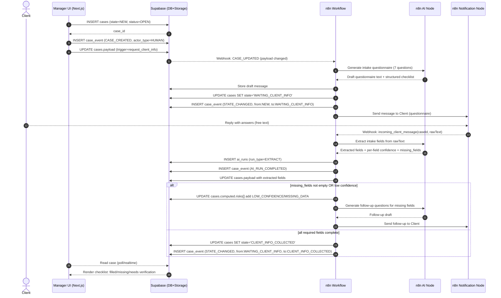
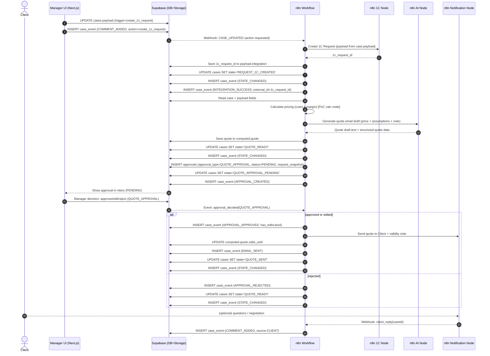
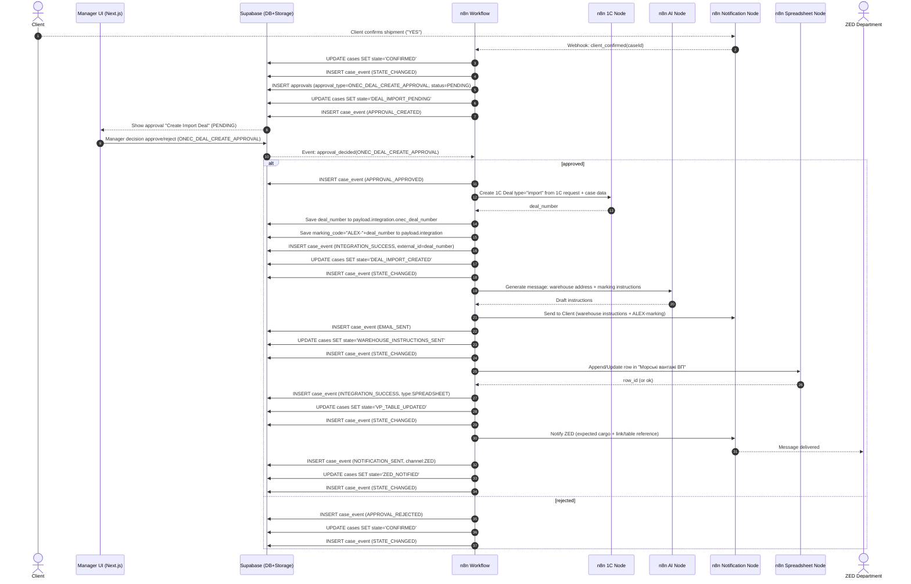
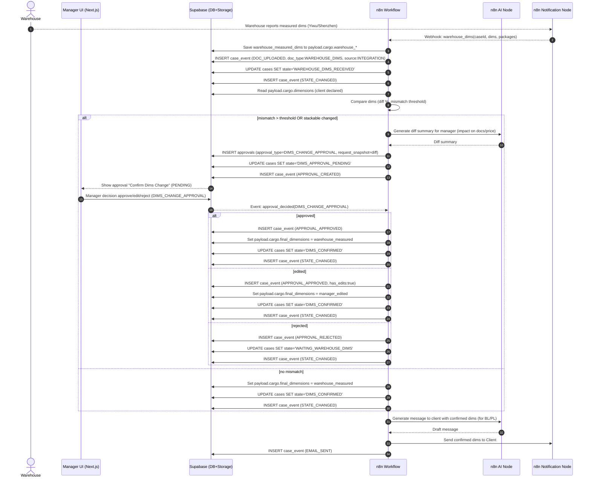
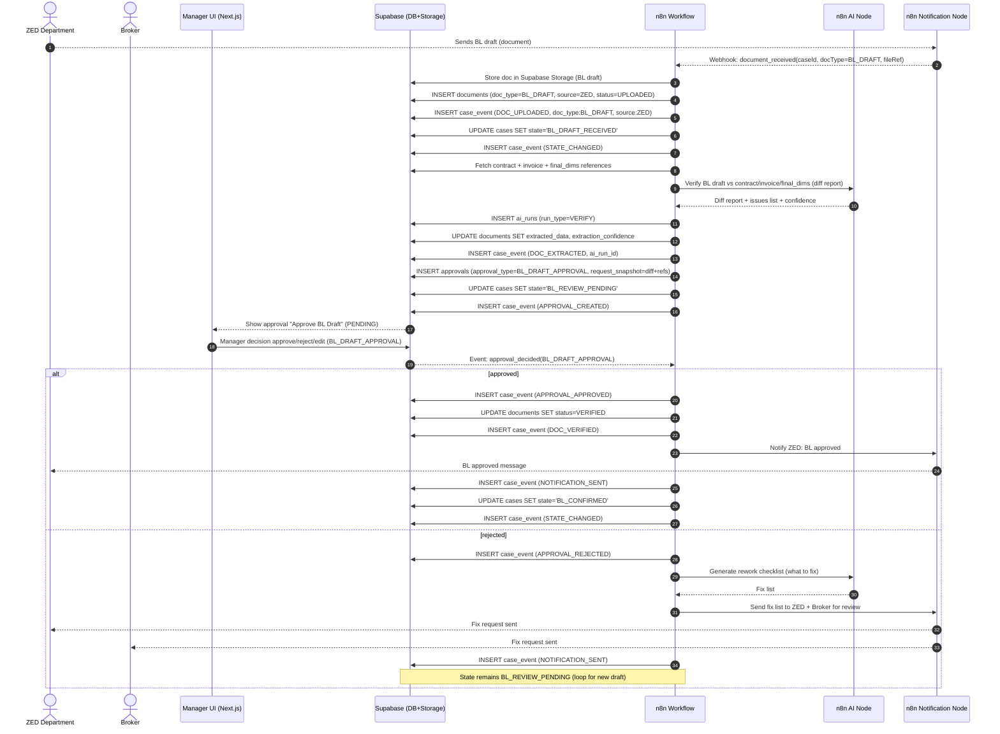
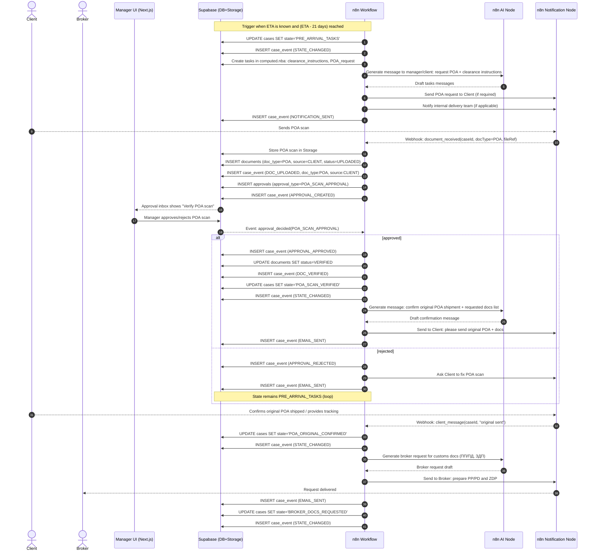

# F1 Sea Import — Sequence Diagrams (Mermaid)

**Case Type:** `F1_SEA_IMPORT`  
**Пов'язані Core документи:**  
- [01_architecture_overview.md](../../core/01_architecture_overview.md) — Sequence Diagrams, UI Contract  
- [02_core_data_model.md](../../core/02_core_data_model.md) — Event Taxonomy, State vs Status

Цей документ містить **Mermaid sequence diagrams** для ключових сценаріїв кейса `F1_SEA_IMPORT`.

Учасники (lifelines) спрощені відповідно до PoC-ландшафту:
- `Manager UI` (Next.js)
- `Supabase` (DB + Storage)
- `n8n Workflow` (orchestrator)
- спеціалізовані `n8n Nodes` (AI / 1C / Notification / Spreadsheet)
- зовнішні актори (Client / Warehouse / ZED / Broker)

> ⚠️ **Термінологія:**  
> - `state` — бізнес-стан (змінюється через `cases.state`)  
> - `status` — технічний агрегат (`OPEN`, `BLOCKED`, `DONE`, `ARCHIVED`)  
> - Events використовують канонічні типи з Core Event Taxonomy

---

## Sequence 1 — Intake: Request Client Info → Extract Answers → Missing Fields Loop

---

## Sequence 2 — Quote: Create 1C Request → Calculate Quote → Approval Gate → Send Quote

---

## Sequence 3 — Client Confirmed: Create Import Deal in 1C → Warehouse Instructions → VP Table → Notify ZED

---

## Sequence 4 — Warehouse Dims: Compare → Dims Approval Gate → Notify Client → Lock Final Dims

---

## Sequence 5 — BL Draft Review: Receive Draft → AI Verify → Approval Gate → Confirm/Rework Loop

---

## Sequence 6 — Pre-Arrival: ETA-3 Weeks Tasks → POA Scan Verify → Original Confirm → Request Broker Docs

---

## Notes / Conventions

### Idempotency (важливо для PoC)

Для дій, які можуть повторитися через retry/webhook duplicates, використовуємо `idempotency_key`:

| Action | Idempotency Key Pattern |
|---|---|
| Send quote | `SEND_QUOTE:<caseId>:<quoteVersion>` |
| Create 1C deal | `CREATE_1C_DEAL:<caseId>` |
| Update spreadsheet | `UPDATE_SPREADSHEET:<caseId>:<rowId>` |
| Notify ZED | `NOTIFY_ZED:<caseId>:<dealNumber>` |

### Source of Truth

- Усі стани (`state`), approvals, документи та історія рішень — у **Supabase**.
- n8n не "тримає" стан, а виконує кроки та пише події/оновлення.
- UI тільки читає state та записує в дозволені поля (`payload.*`, approval decisions).

### Event Logging Convention

Кожен `case_event` має:
- `event_type` — канонічний тип з Core Event Taxonomy
- `actor_type` — `HUMAN` | `SYSTEM` | `AI` | `INTEGRATION`
- `metadata` — JSON зі специфічними даними
- `idempotency_key` — для дедуплікації (опціонально)
