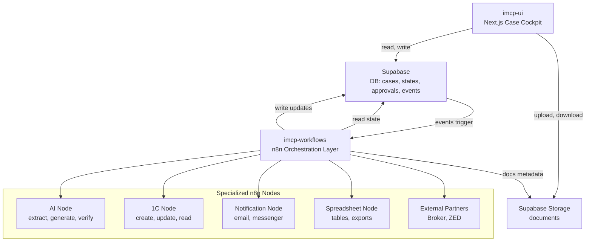
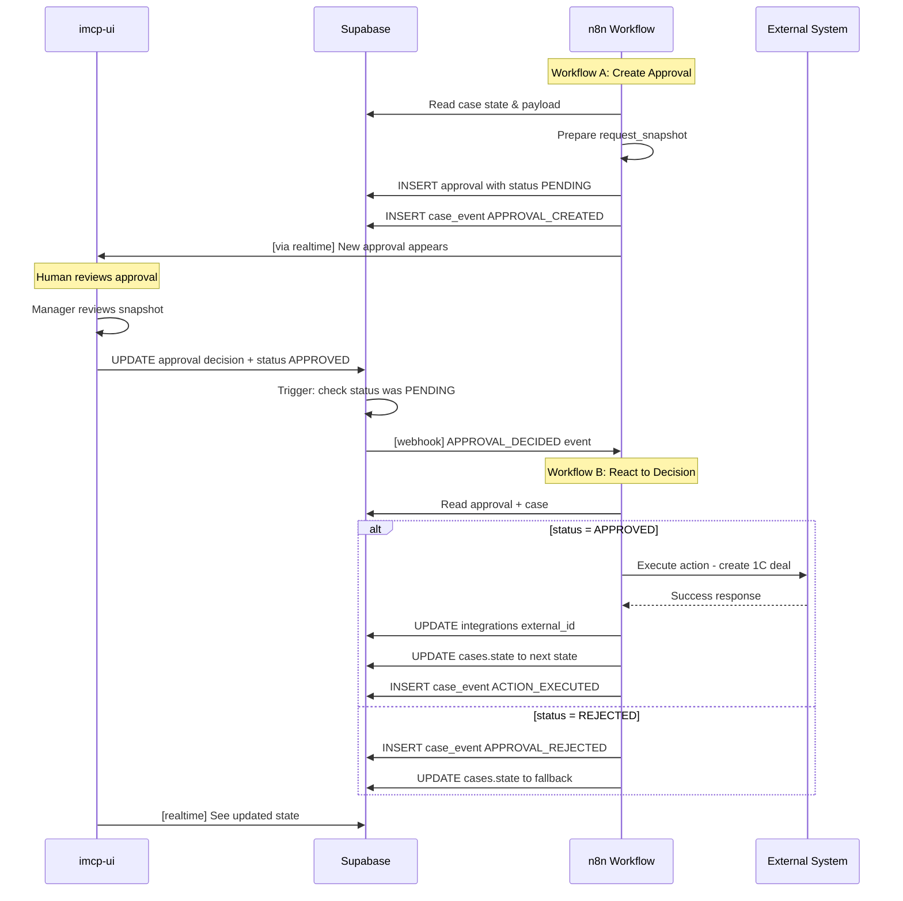
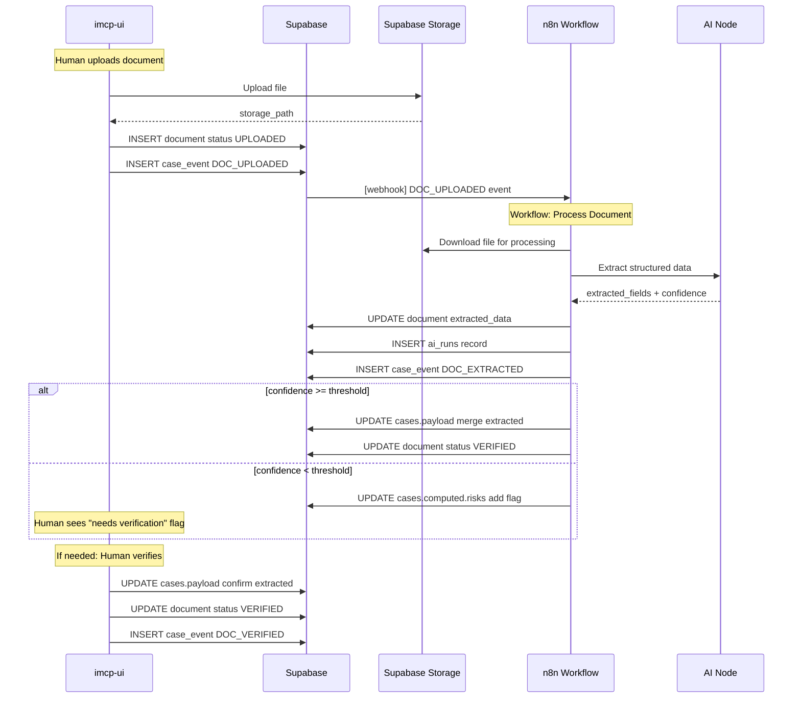
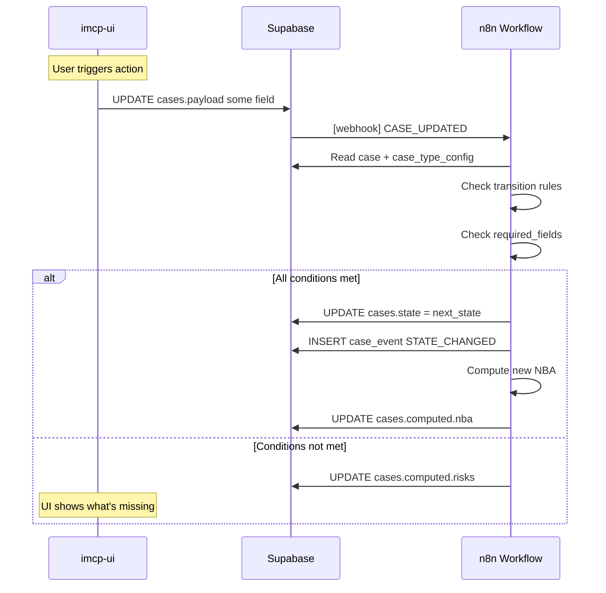
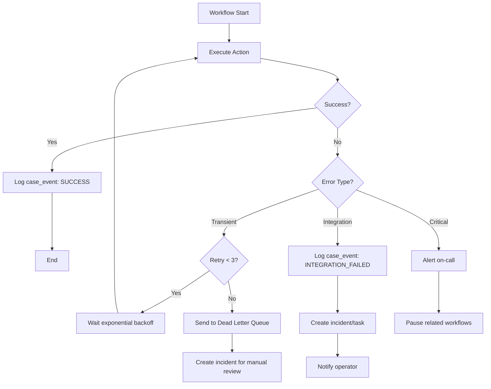

# Architecture Overview  
## IMCP — Iron Man Case Platform

**Версія:** 1.1  
**Статус:** Core / Contract  
**Попередній документ:** [00_shared_mental_model.md](./00_shared_mental_model.md) — ментальна модель  
**Наступні документи:**  
- [02_core_data_model.md](./02_core_data_model.md) — модель даних  
- [03_approval_pattern.md](./03_approval_pattern.md) — патерн підтверджень

---

## 1. Purpose — Навіщо цей документ

Цей документ описує **архітектурний ландшафт IMCP** та є **контрактом** для реалізації.

Він фіксує:
- компоненти та їхні відповідальності
- межі між UI, Supabase та n8n
- sequence flows для ключових операцій
- failure modes та стратегії відновлення
- **що UI НЕ робить** (технічний контракт)

---

## 2. Архітектурний принцип IMCP

> **Supabase — джерело істини.  
> n8n — виконавець і оркестратор.  
> UI — кабіна пілота.  
> ШІ — інструмент, а не субʼєкт рішення.**

Уся платформа побудована навколо **case-driven** підходу та **human-in-the-loop** моделі.

---

## 3. High-Level Architecture



---

## 4. Core Components

### 4.1 imcp-ui — Case Cockpit (Next.js)

**Роль:** Єдиний інтерфейс для менеджера — *кабіна пілота*.

**Відповідальність:**
- відображення стану кейса
- показ ключових даних і документів
- inbox підтверджень (approvals)
- кнопки дій ("запустити", "підтвердити", "відхилити")
- візуалізація ризиків і next best action

---

### 4.2 Supabase — Source of Truth

**Роль:** Центральне сховище стану платформи.

**Зберігає:**
- кейси та їхні стани (`state` + `status`)
- історію подій (`case_events`)
- approvals і рішення людей
- документи та їх версії
- конфігурації типів кейсів

**Ключовий принцип:**
> Якщо чогось немає в Supabase — цього **не існує** для IMCP.

---

### 4.3 imcp-workflows — Orchestration Layer (n8n)

**Роль:** Оркестрація процесів і реакція на події.

**Відповідальність:**
- слухати події з Supabase
- виконувати автоматичні кроки
- викликати спеціалізовані ноди
- писати результати назад у Supabase

**Що n8n НЕ робить:**
- не зберігає стан кейса
- не приймає фінальних рішень
- не є джерелом істини

---

### 4.4 Спеціалізовані n8n-ноди (Logical Adapters)

| Нода | Призначення |
|------|-------------|
| **AI Node** | Extract / Generate / Verify |
| **1C Node** | Create / Update / Read угоди |
| **Notification Node** | Email / Messenger / Slack |
| **Spreadsheet Node** | Таблиці / Exports |
| **External Node** | Broker / ZED API |

---

## 5. UI Contract — Що UI робить і НЕ робить

> ⚠️ **Контракт:** UI має чітко обмежені права на зміну даних.

### 5.1 UI МОЖЕ писати

| Таблиця | Операції | Обмеження |
|---------|----------|-----------|
| `cases` | UPDATE | Тільки `payload.*` (доменні поля), **НЕ** `state`, `status`, `computed` |
| `approvals` | INSERT | Тільки з `status='PENDING'` |
| `approvals` | UPDATE | Тільки `decision_*` поля, і тільки якщо `status='PENDING'` |
| `documents` | INSERT | Метадані нових документів |
| `case_events` | INSERT | Тільки `actor_type='HUMAN'` події |

### 5.2 UI НЕ МОЖЕ

| Заборона | Причина |
|----------|---------|
| ❌ Змінювати `cases.state` | State machine контролюється n8n |
| ❌ Змінювати `cases.status` | Агрегований статус рахується автоматично |
| ❌ Змінювати `cases.computed` | Результати AI/workflow |
| ❌ Змінювати `approvals.status` напряму | Тільки через decision fields |
| ❌ Видаляти `case_events` | Append-only audit log |
| ❌ Запускати workflow напряму | Лише через зміни даних (event-driven) |

### 5.3 Як UI ініціює дії

```
UI хоче щось зробити:
  ↓
UI змінює дані в Supabase (allowed fields)
  ↓
Supabase trigger/webhook
  ↓
n8n workflow реагує
  ↓
n8n робить фактичну роботу
  ↓
n8n оновлює state/computed
  ↓
UI бачить результат
```

---

## 6. Sequence Diagrams — Ключові флоу

### 6.1 Approval Flow: Create → Decide → Execute



### 6.2 Document Flow: Upload → Extract → Verify



### 6.3 State Transition Flow



---

## 7. Event-Driven Interaction Model

IMCP працює за **подієвою моделлю** (детальніше в [02_core_data_model.md](./02_core_data_model.md)).

### Типовий цикл:

```
1. UI змінює дані в Supabase
2. Supabase trigger/webhook відправляє подію
3. n8n workflow отримує подію
4. n8n читає повний контекст з DB
5. n8n виконує бізнес-логіку
6. n8n записує результати в DB
7. UI бачить оновлення через Realtime
```

---

## 8. Failure Modes & Recovery

### 8.1 Failure Categories

| Категорія | Приклад | Severity |
|-----------|---------|----------|
| **Transient** | Network timeout, temp unavailable | LOW |
| **Integration** | 1C відхилив запит, API error | MEDIUM |
| **Data** | Validation failed, missing fields | MEDIUM |
| **Critical** | DB down, workflow crash | HIGH |

### 8.2 n8n Failure Handling Strategy



### 8.3 Retry & Idempotency Rules

| Правило | Опис |
|---------|------|
| **Idempotency Key** | Кожна критична дія має `idempotency_key = case_id + action + version` |
| **Retry Policy** | Max 3 retries, exponential backoff (1s, 4s, 16s) |
| **Dead Letter** | Після 3 спроб → incident + human review |
| **Correlation** | `integrations.correlation_key` для матчингу callbacks |

### 8.4 Integration Failure Handling

```typescript
// Pseudo-code for n8n node
async function executeIntegration(case_id, action, payload) {
  const idempKey = `${case_id}:${action}:${payload.version}`;
  
  // Check if already executed
  const existing = await db.integrations.findByCorrelation(idempKey);
  if (existing?.status === 'SYNCED') {
    return existing; // Already done, return cached result
  }
  
  try {
    const result = await externalSystem.execute(payload);
    
    await db.integrations.upsert({
      case_id,
      correlation_key: idempKey,
      status: 'SYNCED',
      external_id: result.id,
      response_payload: result
    });
    
    await db.case_events.insert({
      case_id,
      event_type: 'INTEGRATION_SUCCESS',
      idempotency_key: idempKey
    });
    
    return result;
    
  } catch (error) {
    await db.integrations.upsert({
      case_id,
      correlation_key: idempKey,
      status: 'FAILED',
      last_error: error.message,
      retry_count: (existing?.retry_count || 0) + 1
    });
    
    await db.case_events.insert({
      case_id,
      event_type: 'INTEGRATION_FAILED',
      metadata: { error: error.message, retry_count }
    });
    
    throw error; // Let n8n retry logic handle
  }
}
```

### 8.5 Recovery Scenarios

| Сценарій | Recovery Strategy |
|----------|-------------------|
| **n8n workflow crash mid-execution** | Workflow restarts, checks idempotency keys, skips completed steps |
| **Supabase temporarily down** | n8n retries with backoff, events buffered |
| **External API returns error** | Log event, create incident, notify operator |
| **Approval timeout** | Cron workflow checks stale approvals, sends reminders |
| **Duplicate webhook** | Idempotency key prevents duplicate processing |

---

## 9. Human Approval Gates in Architecture

Approvals — **first-class citizens** (детальніше в [03_approval_pattern.md](./03_approval_pattern.md)).

### Архітектурні принципи:

| Принцип | Реалізація |
|---------|------------|
| **Async by design** | Workflow не чекає людину, а зберігає approval і завершується |
| **Event-driven** | Рішення людини тригерить новий workflow |
| **Immutable decision** | Після `APPROVED/REJECTED` approval не змінюється |
| **Snapshot semantics** | `request_snapshot` фіксує що саме людина затверджувала |

---

## 10. Separation of Concerns

| Компонент | Відповідальність | НЕ робить |
|-----------|------------------|-----------|
| **imcp-ui** | Показ даних, збір input від людини | Бізнес-логіка, state transitions |
| **Supabase** | Зберігання, RLS, triggers | Orchestration, external calls |
| **n8n** | Orchestration, integrations, state machine | UI, user auth |
| **AI Nodes** | Extract, generate, verify | Прийняття рішень |
| **Людина** | Рішення, верифікація | Рутинні операції |

---

## 11. From PoC to Production

| Аспект | PoC | MVP | Production |
|--------|-----|-----|------------|
| **Workflows** | Hardcoded logic | Config-driven | Config + versioning |
| **Integrations** | Direct HTTP | Dedicated nodes | Microservices |
| **Monitoring** | n8n logs | Basic alerts | Full observability |
| **Recovery** | Manual | Semi-automated | Automated |
| **Scale** | Single instance | Horizontal n8n | Queue-based |

---

## 12. Final Statement

IMCP — це **чітко розмежована система ролей**, де:

- UI показує і збирає, але не вирішує
- Supabase зберігає і захищає
- n8n оркеструє і реагує
- Людина вирішує і несе відповідальність

Цей документ є **контрактом** для реалізації та межею між компонентами.

---

**Наступний документ:** [02_core_data_model.md](./02_core_data_model.md) — як дані організовані в Supabase.
